# Assignment 4 - _Test Plan_

## Step 1 - Default start

Start the main simulator through the command line by entering the command `python simulator.py`. You should see the three-window view as in Figure 1. The leftmost window should be the "Alphabet Builder", the middle the main simulator control window, and the rightmost window the "State Builder".

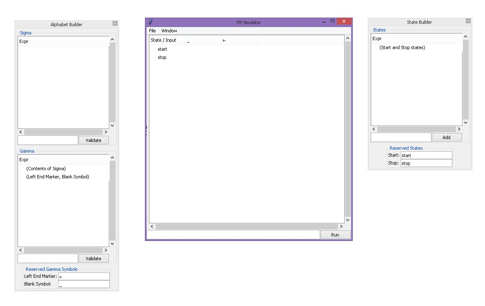{#id .class width=600px}

## Step 2 - Import and Export

This step tests the machine encoding import and export functions, as well as the default machine configuration. 

Click the menu item "File > Export machine...". You should see the message box with the text "Machine encoding has been copied to clipboard". Open a text editor (for example, `notepad`), and paste the contents of the clipboard. It should match the following string:

`gAMoXXEAXXEBXXECWAMAAADiiqJxA1gDAAAA4o61cQRdcQVdcQZYBQAAAHN0YXJ0cQdYBAAAAHN0b3
BxCHRxCS4=`

Click the menu item "File > Import machine...". You should see the message prompt to enter a machine encoding as in Figure 2.

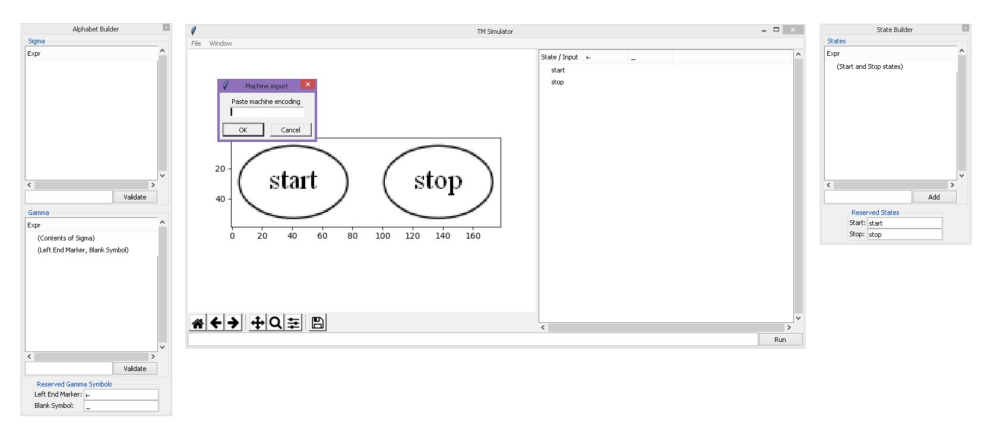{#id .class width=600px}

Enter the following encoding string:

`gAMoXXEAKFgCAAAAcTFxAVgCAAAAcTJxAlgCAAAAcTNxA1gCAAAAcTRxBFgCAAAAcTVxBVgHAAAAcW`

`FjY2VwdHEGZV1xB1gBAAAAMHEIYV1xCShYAQAAAHhxCmgIZVgCAAAAfC1xC1gBAAAAIHEMXXENKGgDa`

`AyGcQ5oBGgIhnEPaARoCoZxEGgDaAiGcRFoAmgKhnESaAFoC4ZxE2gBaAiGcRRoAmgMhnEVaAVoDIZx`

`FmgFaAqGcRdoBWgIhnEYaAJoCIZxGWgDaAqGcRplXXEbKF1xHGgFaAxYAQAAAExxHYdxHmFdcR9oA2g`

`KWAEAAABScSCHcSFhXXEiaARoCmggh3EjYV1xJGgEaAhoIIdxJWFdcSZoAmgKaCCHcSdhXXEoaAFoC2`

`ggh3EpYV1xKmgCaAxoIIdxK2FdcSxoBmgMaCCHcS1hXXEuaAJoDGggh3EvYV1xMGgFaApoHYdxMWFdc`

`TJoBWgIaB2HcTNhXXE0aANoCmggh3E1YV1xNmgDaApoIIdxN2FlaAFoBnRxOC4=`

and press OK to submit. The imported machine should match the following exactly, including imported Sigma, Gamma and left-end, blank symbols (Figure 3).

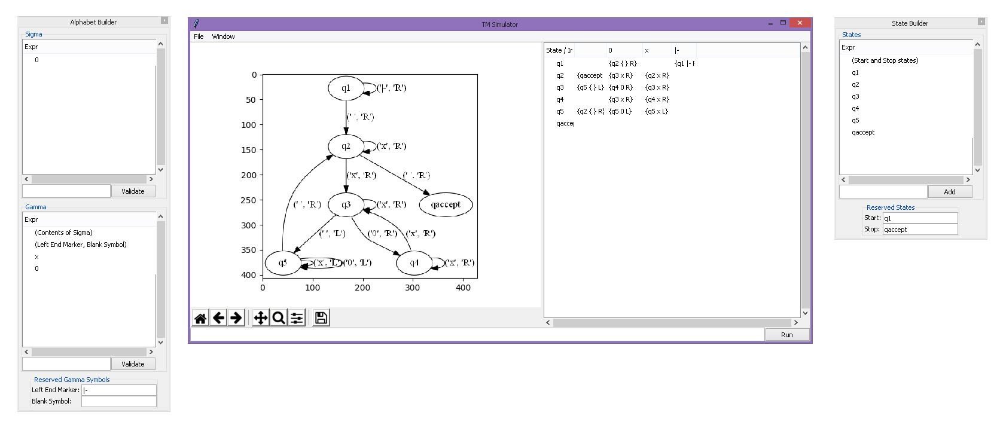{#id .class width=600px}

## Step 3 - Simulation

This step tests the machine simulation functions on an imported machine configuration.

Enter into the main simulator window's input box the string `0`. The "Run" button should be activated. Note that this implicitly initializes the input tape with the contents "Left-end marker, `0`". Click "Run" and the following message box should appear, indicating acceptance (Figure 4).

{#id .class width=600px}

Accept this message box and the following window should appear, displaying the accepting computation trace (Figure 5).

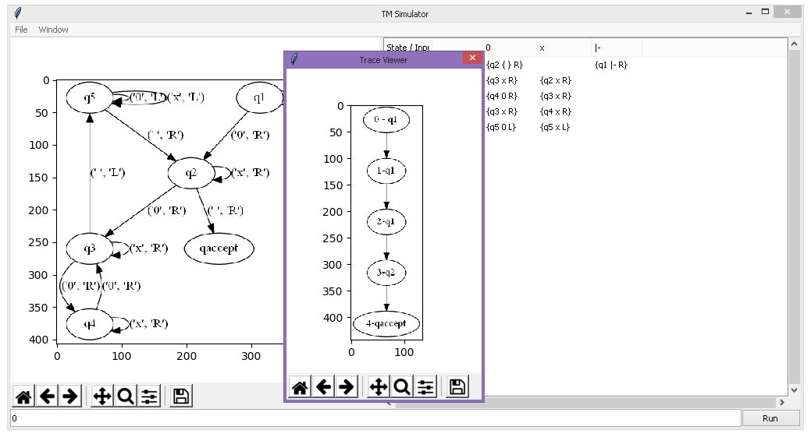{#id .class width=600px}

## Step 4 - Editing

This step tests the machine edit and simulation functions on an edited machine configuration.

Start controlling the Alphabet Builder window. Enter `1` into the Sigma edit box and click "Validate" to add the symbol `1` into the Sigma alphabet. After doing so, the Alphabet Builder should look as in Figure 6, with `1` appearing in both the Alphabet Builder Sigma listing as well as the main window's transition table.

{#id .class width=600px}

Double-click on the cell in the transition table under the column `1` and the row `q1` to edit the transition upon reading the symbol `1` while in the state `q1`. In the drop-down box for "Output state", select `q2`, for "Output symbol" select (blank), for "Head direction" select `R`. The window should then look like Figure 7. 

{#id .class width=600px}

Click "Add", then "Apply" to insert the transition; the main edit window should then look like Figure 8, with the correct transition inserted.

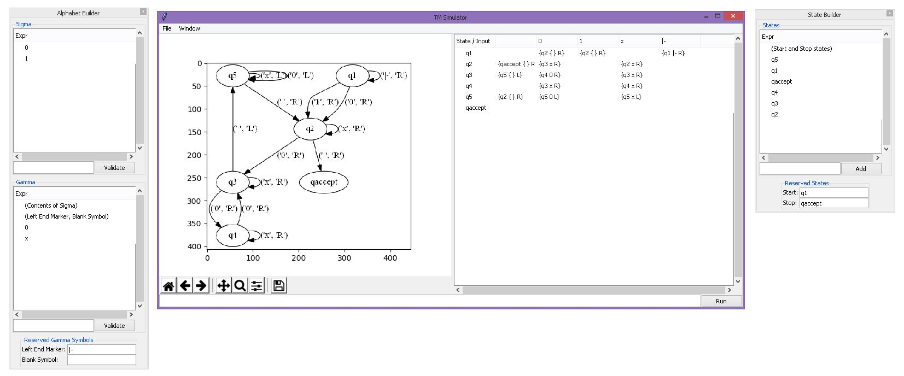{#id .class width=600px}

Enter into the main simulator window's input box the string `1`. The "Run" button should be activated. Click "Run" and the following message box should appear, indicating acceptance (Figure 9).

{#id .class width=600px}

Accept this message box and the following window should appear, displaying the accepting computation trace (Figure 10).

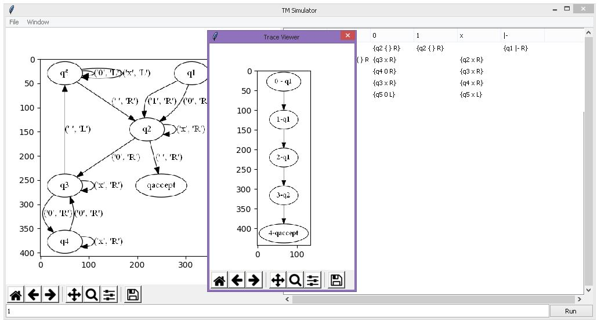{#id .class width=600px}

## Step 5 - Alternation

Open the simulator window and resize to see the graph view using the panel slider. Click File > Import sample machine to import a sample machine to edit. After this, the simulator should look like Figure 11.

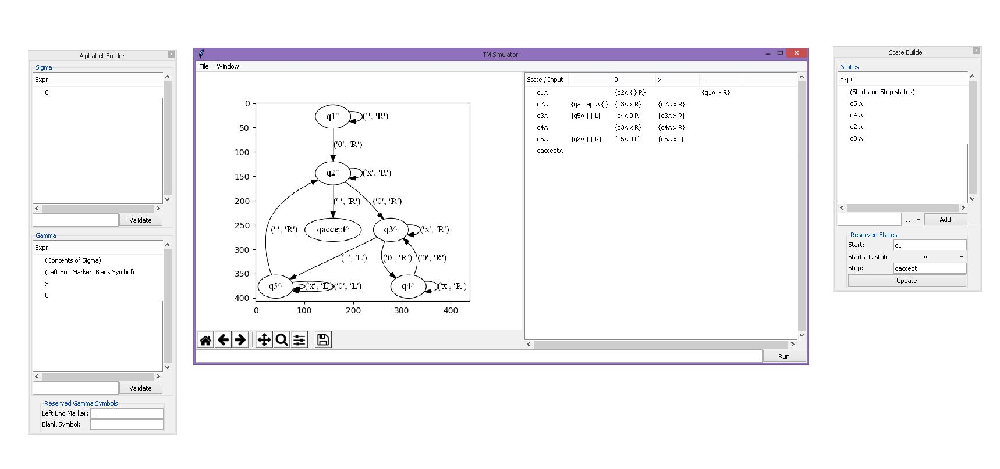{#id .class width=600px}

In the state builder window, add a new state `p`, keeping the default alternation state selection (`and`). (Figure 11)

{#id .class width=600px}

In the spreadsheet editor view, double click on the column for symbol `blank` and row for state `q1`. Add a second transition to the list, transitioning into the `p` state, writing a `blank`, and moving the head to the right. (Figure 12)

{#id .class width=600px}

After accepting this editing, the window should look like Figure 13.

{#id .class width=600px}

In the spreadsheet editor view, double click on the column for symbol `blank` and row for state `p`. Add a transition to the list, transitioning into the `qaccept` state, writing a `blank`, and moving the head to the right. (Figure 14)

{#id .class width=600px}

Enter into the main simulator window's input box the string `0`. The "Run" button should be activated. Click "Run" and the machine should accept and show the accepting computation trace. (Figure 15)

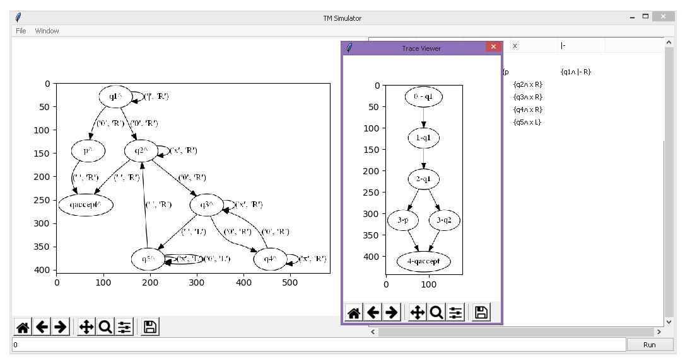{#id .class width=600px}

## Step 6 - Bounds

Open the simulator window and resize to see the graph view using the panel slider. Click File > Import sample machine to import a sample machine to edit. The time and space bound entry boxes should be default blank. Enter into the main simulator window's input box the string `0`. The "Run" button should be activated. Click "Run" and the machine should accept and show the accepting computation trace. (Figure 16)

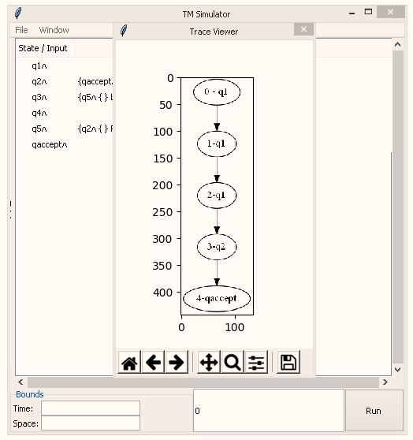{#id .class width=600px}

Enter into the time bound input box the string `5`. Click "Run" and the machine should accept and show the accepting computation trace. (Figure 17)

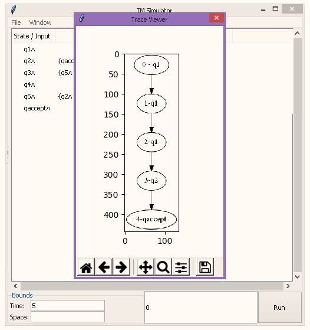{#id .class width=600px}

Enter into the time bound input box the string `2`. Click "Run" and the machine should reject for exceeding the time step limit. (Figure 18)

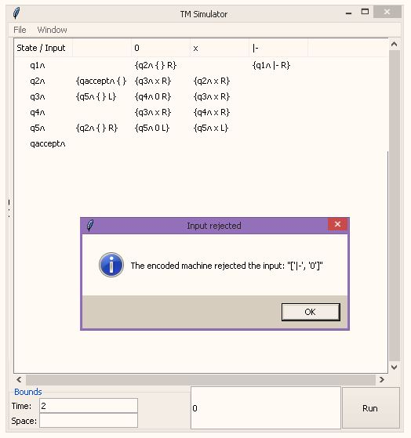{#id .class width=600px}